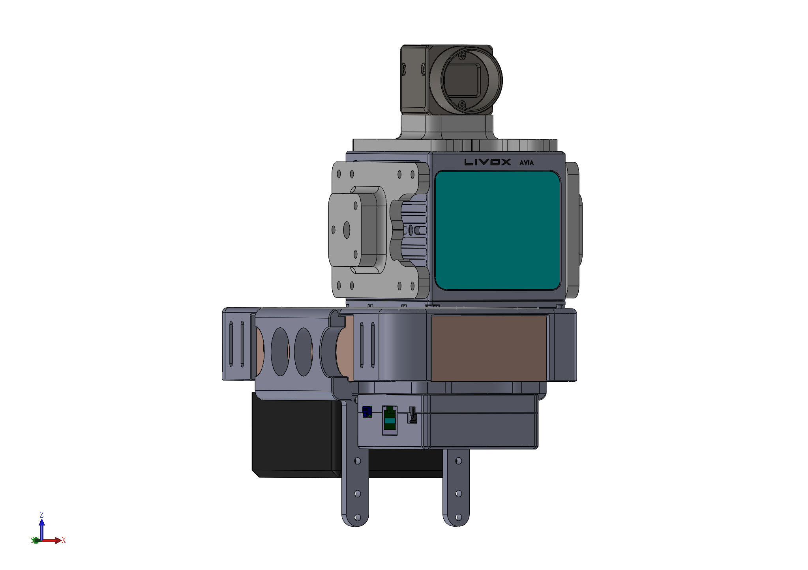

# our_sensor_suit

    

Contributors: [Haotian Li](https://github.com/luo-xue), [Yuying Zou](https://github.com/cicizou).

This repository provides the CAD files of a simple version of our handheld device. The corresponding equipment selection can be seen in **VI.B.1** of the paper [FAST-LIVO: Fast and Tightly-coupled Sparse-Direct LiDAR-Inertial-Visual Odometry](https://arxiv.org/abs/2203.00893).
